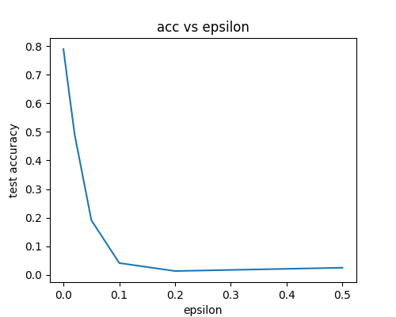
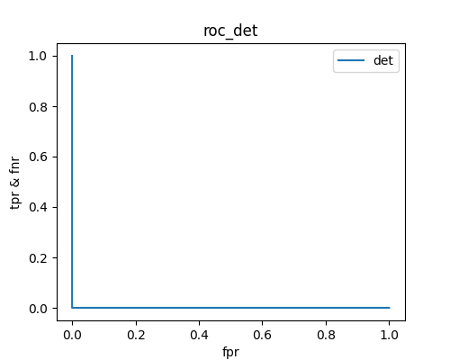

#### **Nirbhay Sharma (B19CSE114)**
#### **Assignment -1**

---


### **Que-1**


**Part-1**

We use a three layer simple neural network for the task. The model is first trained on CIFAR10 dataset till convergence. We train the model using ADAM optimizer with learning rate as $1e^{-3}$. The FGSM attack is made according to the following equation:

$$
x_{adv} = x + \epsilon \hspace{0.1cm} sign(\triangledown_{x} L(x,y))
$$

where $x$ and $y$ denotes the image sample and corresponding label respectively. $L(x,y)$ denotes the CrossEntropyLoss function. The $x_{adv}$ is used to misclassify the model's output. The epsilon vs accuracy denotes the impact of the attack. As the epsilon increases the accuracy of the model decreased after attack

**Accuracy before attack with $\epsilon = 0$**

|model|acc_before_attack|
|---|---|
|3 layer net|0.79|

**Accuracy after attack with different $\epsilon$**

<div class="img_div">

</div>


**Part-2**

We choose two neural networks as Resnet18 and Shufflenet. The idea behind choosing the network is to compare two different architecture which have a significant difference in terms of number of trainable parameters. Resnet18 has around 11M trainable parameters while shufflenet has around 2M parameters. Thus there is a drastic difference in complexity and comparison of attacks on them would provide the robustness of models as well as attacks

We train both the networks with ADAM optimizer with learning rate as $1e^{-3}$ till convergence and then we apply MASK based and PGD attack on both of them. The results are shown below.

|model|acc_before_attack|PGD|Mask ($\epsilon=0.05$)|
|---|---|---|---|
|Resnet18|0.92|0.66|0.84|
|Shufflenet|0.88|0.60|0.70|

The variation of MASK based FGSM attack with $\epsilon$ is represented below

<div class='img_div'>
<div class="img_inside">

<p style="text-align:center">(a) Resnet18 Mask attack</p>
</div>
<div class="img_inside">

<p style="text-align:center">(b) Shufflenet Mask attack</p>
</div>
</div>

The variation of PGD attack with $\epsilon$ is represented below

<div class='img_div'>
<div class="img_inside">

<p style="text-align:center">(a) Resnet18 PGD attack</p>
</div>
<div class="img_inside">

<p style="text-align:center">(b) Shufflenet PGD attack</p>
</div>
</div>


PGD attack is more effective in terms of dropping the accuracy of neural network. The MASK attack on the other hand is effective with higher epsilon values where we provide more weight to the perturbations. PGD attack on changing epsilon values gives similar results only as seen in the Figures.


**Part-3**

Resnet18 model is implemented and used for protecting the three layered network used in first part by FGSM attack. The network is trained for a binary class classification task to detect the adversarial vs normal samples. The loss function used in CrossEntropyLoss for two class classification. The three layered neural network model is first attacked using FGSM attack the adversarial sample generated by the attack is then fed into the model along with original sample to detect for the attack. The results are as follows


|model|protected model|attack|Detection accuracy|
|---|---|---|---|
|Resnet18|3 layer Net|FGSM($\epsilon=0.07$)|0.87|

### **Que-2**

FaceSwap ([FaceSwap](https://github.com/wuhuikai/FaceSwap)) repo is used to create face swaps with celebrity images.

Deepfake examples

|original_image|deepfake|
|---|---|
|||
|||
|||

**DeepFake detection using Siamese network**

The entire workflow is represented below. The siamese network is used to maximize the inter class and minimize the intra class variations among the features.

<div class='img_div'>

</div>


The overall loss function used is:

$$
L_{sim}(Z1, Z2, Y1, Y2) = L(Z1, Z2) + L_{CE}(Z1, Y1) + L_{CE}(Z2, Y2)
$$

where $L_{CE}$ denotes CrossEntropyLoss and $L(Z1, Z2)$ is the similarity or dissimilarity loss function depending upon the Image1 and Image2 belongs to same category or not. The results are as follows:

|model|Method|Accuracy|
|---|---|---|
|Resnet18|Siamese|0.73|
|Resnet18|Naive Binary Classification|0.66|

Comparing the above approach with simple binary classification approach, siamese network approach works considerably better than normal binary class classification. The possible reason could be siamese network is more capable in separating out the different features using the L2 loss function and it maximizes the inter class features and minimizes the intraclass features. Thus providing higher performance.

### **Que-3**

For audio deepfake classification the first approach is to use Melspectrograms along with siamese network to classify the original vs deepfake audios. The audios are recorded by me and then converted to deepfakes using ([TTS](https://github.com/coqui-ai/TTS)) repo. The data has audios corresponding to the text which is provided in the excel file. corresponding to similar text we generate deepfake audios using aforementioned TTS system.

The data is gathered and fed into the following workflow. The audio data is first converted into Melspectrograms after required sampling, padding etc. steps, which are then fed into siamese network for deepfake classification. Here again we use same loss function $L_{SIM}$ as explained in the Que-2. The entire pipeline is represented in the figure below. 

<br/>


<div class='img_div'>

</div>


The DET curve is implemented from scratch. The DET curve is basically the plot of FNR (False Negative Rate) which is (1 - TPR) against FPR (False Positive Rate). The scratch implementation is below:


```py
def roc_det(y_true,y_pred,save_path):
    metrics = {'fpr':[],'tpr':[],'fnr':[]}
    for i in np.arange(0,1.2,0.001):
        new_y = copy.deepcopy(y_pred)
        y_pred_new = (new_y > i)
        fp = ((y_true == 0) & (y_pred_new == 1)).sum()
        tp = ((y_true == 1) & (y_pred_new == 1)).sum()
        fn = ((y_true == 1) & (y_pred_new == 0)).sum()
        tn = ((y_true == 0) & (y_pred_new == 0)).sum()
        metrics['fpr'].append(fp/(fp+tn))
        metrics['tpr'].append(tp/(tp+fn))
        metrics['fnr'].append(fn/(fn+tp))
    plt.figure(figsize=(5,4))
    plt.plot(metrics['fpr'], metrics['fnr'], label='det')
    plt.xlabel('fpr')
    plt.ylabel('tpr & fnr')
    plt.title('roc_det')
    plt.legend()
    plt.savefig(save_path)
    plt.show()
```

Using above function we can also plot the roc curve in association with the det curve which helps in visualization better. 

The DET curve for the above implementation is:

<br/>
<br/>
<br/>


<div class='img_div'>

</div>

similarly the assist architecture is also trained on the audio files. The DET curve is represented below

<div class='img_div'>

</div>

The results in terms of test accuracy is as follows:

|Approach|Test_accuracy|
|---|---|
|Spectrograms + Siamese|0.98|
|Assist|0.50|

The possible drop in accuracy in Assist is the lack of significant amount of data, As the dataset size is small as compared to what is required by Assist. Thus we observe a considerable drop in accuracy. If more data could have provided to Assist it would have perform better. Melspectrograms + siamese approach on the other hand performs much better due to fact that it can maximize the inter class variations and minimize intra class variations in the feature space. Thus this approach is easily be able to handle the less amount of data and learned the feature space better and performs excellent on the unseen test dataset. 


The audio dataset can be found at the link ([audio_data](https://drive.google.com/drive/folders/1w_swSg6WuT0KnDhV6Z6aRW6TE2I954LE?usp=share_link)) and the csv file corresponding to the text is provided with the zip file


<style> 

table, th, td {
  border: 0.1px solid black;
  border-collapse: collapse;
}

.img_div{
    display:flex;
    align-items:center;
    justify-content:center;
}

h3 {
    color: #e71989;
}

</style>

<script type="text/javascript" src="http://cdn.mathjax.org/mathjax/latest/MathJax.js?config=TeX-AMS-MML_HTMLorMML"></script>
<script type="text/x-mathjax-config">
    MathJax.Hub.Config({ tex2jax: {inlineMath: [['$', '$']]}, messageStyle: "none" });
</script>