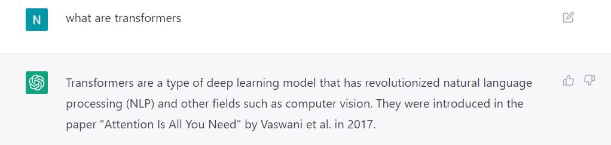
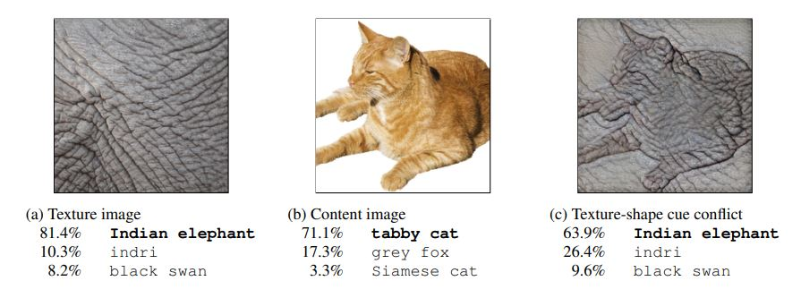

#### **Nirbhay sharma (B19CSE114)**
#### **Minor2**

---


### **Ans-1.**

Deep learning models generally have a tendency to get biased towards any characterstick of data. There have been various cases reported regarding gender bias, classifying humans to animals and so on. Generally these biases come into existance due to any kind of bias in the dataset itself. For example if the dataset contains comparatively more information for one class than other class, the model is more likely to be biased towards the containing more information and so on. Considering this there have been my person cases of seeing bias in deep learning models. There are numberous examples in this regard.

**ChatGPT**

ChatGPT proves to be a very effective and knowledgable chat bot. However, the model itself is biased towards some specific type of keywords. I call it keyword bias. Here is an example of this.



As clear from the above image, when I ask about transformers, due to bias in chatgpt it only tells me about Deep learning transformers and not about electrical transformers or the transformer movie. It clearly shows a considerable amount of bias in the model towards the keyword transformer. There can be multiple number of examples as well in which the language models are biased towards specific keywords.

**Bias towards texture**


The CNN's are well known for their high performance for Image classification task. The CNN's are famous for learning deep representations in the image and provide a high classification, detection, segmentation performance. However, at the backend this is not always the case. [1] shows the bias of CNN towards textures and not shape of the object. In simple terms the CNN models learns the texture of the image to classify it to a particular class. The texture basically represents the pixel intensities at various locations. The CNN, while learning about the image, unknowingly learns the texture only and not learn the shape and other features of the image. Which makes it bias towards a particular texture not the object in the image itself. An example is presented below



As clear from the above example, In the first image where elephant skin is there the classifiation is perfect. In second example as well the classification is good. However, in the third example which is a style transfer of elephant skin on cat image, the CNN classify it as elephant. This behaviour is purely because of textural bias learnt by the CNN at the time of training. This kind of bias is also addressed by the paper explained in the second question.

[1] Geirhos, Robert, et al. "ImageNet-trained CNNs are biased towards texture; increasing shape bias improves accuracy and robustness." arXiv preprint arXiv:1811.12231 (2018).


### **Ans-2.**

**Permuted AdaIN: Reducing the Bias Towards
Global Statistics in Image Classification**

The authors have tried to address the problem of bias towards textures in image classification task. In general the algorithms involving CNN are prone to get biased towards texture of image only and not to other cues which includes shape etc. The authors have proposed a novel normalization technique namely Permuted Adaptive Instance Normalization (PAdaIN) which tries reduces representations of global statistics in the hidden layers on image classifier. Therefore, making the image recognition problem invariant to global image statistics and improves its performance towards texture recognition. The authors also claim that the aforementioned approach is capable enough to handle domain shifts as well. In other works it can be useful in domain adaptation tasks.


There have been recent works that are proposed in this direction. Some papers tries to make use of dropout layers. Some proposes adversarial training in reducing textural bias, and other various approaches targetting bias. There have been various normalization techniques proposed as well in literature. Some includes BatchNormalization, Instance Normalization, Layer Normalization, Group Normalization etc. However, unlike normalization layers the purpose of PAdaIN is to not provide an efficient training but to direct the network towards learning the shape and other fine details in the image. Therefore, the proposed normalization layer provides a plug and play functionality where it can be used within the network after the convolution layers and before the batch-norm layers.


The algorithm (PAdaIN) is represented mathematically as follows.

First defining Instance Normalization (IN). Consider a feature map $x \in R^{N \times C \times H \times W}$. The Instance Norm is defined as:

$$
IN(x) = \gamma (\frac{x-\mu(x)}{\sigma(x)}) + \beta
$$

where $\mu(x)$ and $\sigma(x)$ denotes the mean and standard deviation in the space $R^{N \times C}$. Therefore, defined as:

$$
\mu(x) = \frac{1}{HW} \sum_{h \in [H]} \sum_{w \in [W]} x
$$

$$
\sigma(x) = \sqrt{\frac{1}{HW} \sum_{h \in [H]} \sum_{w \in [W]} (x-\mu(x))^2 + \epsilon}
$$

where we define $[W]$ as an interval of integers ranging from one to W, i.e. $[1,W]$

Then AdaIN is defined over two feature maps. It first tries to normalize $a$ then it tries to scale it up by the statistics of $b$. Therewore it is defined as:

$$
AdaIN(a,b) = \sigma(b) (\frac{a-\mu(a)}{\sigma(a)})  + \mu(b)
$$

where $\mu(a)$ and $\sigma(a)$ are mean and standard deviation of $a$ respectively.

Finally we define permuted AdaIN as follows. Let $x \in R^{N \times C \times H \times W}$ be a feature activation map having components as $x = x_1, x_2, ..., x_N$ and let $\pi(x) = [x_{\pi(1)},x_{\pi(2)},...,x_{\pi(N)}]$ be the permuted feature map after applying a permutation $\pi$. On this permutation and the original feature map we apply $PIN^{\pi}(x)$ operation as follows

$$
PIN^{\pi}(x) = AdaIN(x_i, x_{\pi(i)})
$$

Finally the permuted AdaIN operation on a feature map $x$ is as follows

**If the feature maps are not permuted**

$$
PAdaIN(x) = x 
$$

**If the feature maps are permuted with probability $p$**


$$
PAdaIN(x) = (PIN^{\pi}(x_1), PIN^{\pi}(x_2), ..., PIN^{\pi}(x_N)) 
$$

The authors have already mentioned in the paper that the PAdaIN is applied after the convolution layer and before the batch-norm layer. The batch-norm layers after the application of PAdaIN does not undo the effect of it. Rather it scales up the output using batch-wise statistics.


**Extension to PAdaIN**

The above algorithm utilizes the following steps:

- It gets the feature maps $x \in R^{N \times C \times H \times W}$ after a particular convolution layer
- Later it randomly permutes the individual feature vectors along the batch dimension with a probability $p$
- Once the permutation is obtained we get two tensors one is permuted one and another is original one
- Finally it calculates the AdaIN of $x_i$ and $x_{\pi(i)}$ 
- This is done for all the tensors along the batch-size dimension
- The output is same as the size of original feature maps which are then passed on to the next convolution layer.

The algorithm tries to capture features other than texture such as shape etc. The algorithm is probabilistic and its first step requires to create a random permutation of the feature maps in the batch-size dimension. The algorithm permutes the feature maps Batch-wise which keeps the features in individual channels intact. The final AdaIN is primarily based on the one-one mapping of original features to the permuted features. The aforementioned approach does not share the information in between the channels. Therefore, The extension is as follows: 

- The idea is to not perform random permutation of feature maps instead use a deterministic channel shuffle operation 
- After channel shuffle operation the AdaIN operation is applied to the original feature maps and shuffled feature maps
- Thereafter combine all of these into final PAdaIN normalization layer.

**Channel shuffle operation**

- This operation takes in a feature map $x \in R^{N \times C \times H \times W}$ and group size $g \in I^{+}-\\{0\\}$. Please note that $g$ should be a positive integer ($\ne 0$) and should be a factor of $C$
- Once $g$ and $x$ are provided, the channel shuffle operation divides the channel dimension into $\frac{C}{g}$ groups which are then transposed and later on concatenating the individual groups to again form $C$ channels in order to keep the dimension of the feature map intact.

The pseudo code of channel shuffle algorithm is here:

```py
def channelshuffle(x, g):
    N, C, H, W = x.shape # extracting individual dimensions
    groups = C // g # g should divide C
    x = x.reshape(N,g,groups,H,W) # dividing channels into g groups
    x = x.transpose(1,2) # shuffle operation 
    x = x.reshape(N,-1,H,W) # back to original shape
    return x
```

Therefore the final alorithm for PAdaIN is as follows (assuming AdaIN(a,b) function is available to us)

Please note the algorithm is just pseudo code (syntax may not be followed properly)


<br/>
<br/>
<br/>
<br/>
<br/>
<br/>
<br/>
<br/>
<br/>
<br/>


```
def AdaIN(a,b):
    # assuming definition provided
    pass

def CSAdaIN(x, g):
    # with probability p apply the operation
    CS_x = channelshuffle(x, g)

    final_maps = []
    for (omap, csmap) in (x, CS_x):
        adain_x = AdaIN(omap, csmap)
        final_maps.append(adain_x)
    
    concatenated_map = concat(final_maps, dim=1)
    return concatenated_map
```

The above approach is proposed as CSAdaIN (Channel shuffled Adaptive Instance Normalization). Unlike PAdaIN which permutes the feature maps and shares the information batch-wise, CSAdaIN first shares the information channel wise by grouping them and then apply the AdaIN algorithm on the one-one correspond features of resultant feature maps. Hence shares the channel wise information among the feature maps and thereafter apply the normalization. Thus providing more information sharing and helps the network to learn different types of features.


<style> 

table, th, td {
  border: 0.1px solid black;
  border-collapse: collapse;
}

h3 {
    color: #e71989;
}

</style>

<script type="text/javascript" src="http://cdn.mathjax.org/mathjax/latest/MathJax.js?config=TeX-AMS-MML_HTMLorMML"></script>
<script type="text/x-mathjax-config">
    MathJax.Hub.Config({ tex2jax: {inlineMath: [['$', '$']]}, messageStyle: "none" });
</script>