#### **Nirbhay Sharma (B19CSE114) ; Chirag Goyal (B19CSE105)**
#### Programming assignment TSA

---

**Question**: Model the topic assigned using the data according to the topic mentioned. You should model the following-
1. ARMA/ ARIMA and its variation
2. ARCH/ GARCH and its variation.
3. Perform Forecasting and its evaluation.
Make sure you test the relevant tests for each of these three. 

**Approach and Implementation of the Problem**

To implement the problem, we are going to utilize the Box-Jenkins methodology:

### **Data Collection & Data Format**

Collect the time series data relevant to the problem at hand. This could include historical data on stock prices, sales data, weather data, or any other data that exhibits a time-dependent pattern.

Here, we are using the data that has four columns containing the daily data for opening, closing, high, and low values of the BSE 100 dataset from 2016 to 2023. For analysis purposes, we use Open columns only. 

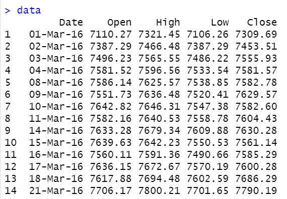

### **Analysing $y$ and $\triangle y$**

1. Analyzing the time series data for variable y and its corresponding change in y provides valuable insights into the trends and dynamics of the dataset over time.
2. Studying the patterns and behavior of both y and its change allows for a more comprehensive analysis of the dataset, revealing important information about the underlying factors driving the changes observed in y. This analysis can aid in making informed decisions and predictions based on the dataset's characteristics.

**Plots for the data patterns**

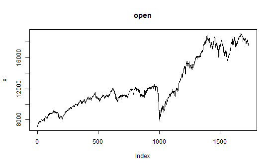

(a) y

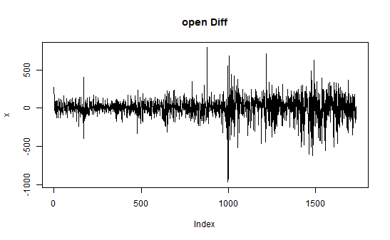

(b) &#9651y

### **Analysing ACF and PACF of $y$ and $\triangle y$**

1. Analyzing the Partial Autocorrelation Function (PACF) and Autocorrelation Function (ACF) of variable y and its change provides valuable insights into the dataset's time-dependent relationships and potential lag effects.
2. The PACF and ACF plots offer valuable visualizations that can help identify the significant lags in y and its change, which can be useful in determining the appropriate order for AR (AutoRegressive) and MA (Moving Average) components in time series models like ARIMA and GARCH.

**Plots for ACF for $y$ and $\triangle y$**

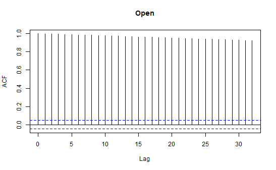

(a) y

(b) &#9651y

**Plots for PACF for $y$ and $\triangle y$**

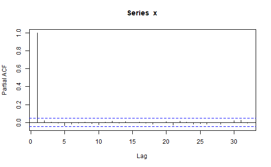

(a) y

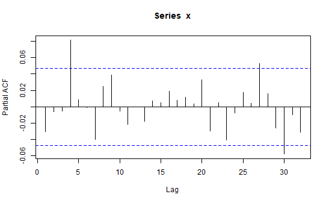

(b) &#9651y

### **Exploratory Data Analysis (EDA)**

Perform EDA on the time series data to gain insights into its properties, such as trend, seasonality, and stationarity. This can be done using visualizations, statistical tests, and other techniques.

### **Test of stationarity**

**ADF & PP test of $y$ and $\triangle y$**

1.Testing for stationarity is a critical step in ARMA/ARIMA modeling, as it ensures that the time series data exhibits consistent statistical properties over time and is suitable for modeling.
2. Common tests for stationarity, such as the Augmented Dickey-Fuller (ADF) test or PP test, stand for "Phillips-Perron." The Phillips-Perron test is a statistical test used to test for the presence of a unit root in time series data, which indicates non-stationarity. It is a variation of the Dickey-Fuller test that corrects for autocorrelation and heteroscedasticity in the residuals, making it a useful tool for testing stationarity in time series data. The Phillips-Perron test is commonly used in econometrics and time series analysis to assess the stationarity of a dataset before applying various time series models, such as ARIMA or GARCH. It can help determine if the time series data is stationary or requires further preprocessing before fitting an ARMA/ARIMA model.

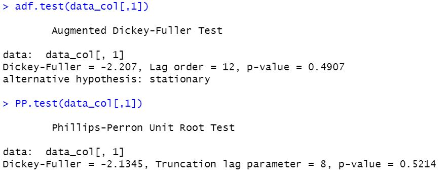

(a) y

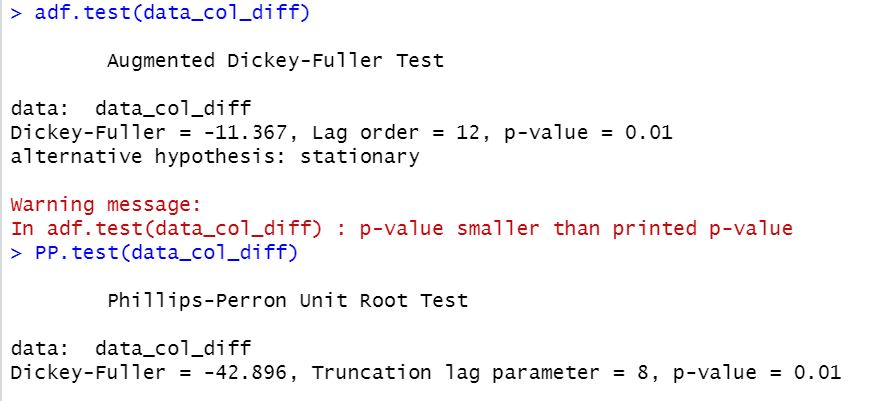

(b) &#9651y

**Box-Pierce test for $y$**

1. The Box-Pierce test is a statistical test commonly used in time series analysis to assess the goodness-of-fit of a model by examining the residuals of the fitted model for variable y.
2. The Box-Pierce test statistic, calculated from the autocorrelation function (ACF) of the residuals, provides a quantitative measure of the residual autocorrelation, which can indicate if the model is capturing the underlying patterns in the data or if further model refinement is needed.

|$\chi$-squared|df|P-value|
|---|---|---|
|1726.9|1|$\lt 2.2e^{-16}$|
|3446.2|2|$\lt 2.2e^{-16}$|
|5157.9|3|$\lt 2.2e^{-16}$|
|6862|4|$\lt 2.2e^{-16}$|
|16915|10|$\lt 2.2e^{-16}$|
|25065|15|$\lt 2.2e^{-16}$|
|28269|17|$\lt 2.2e^{-16}$|

### **ARIMA Modelling for $y$**

Choose the appropriate ARMA or ARIMA model based on the properties observed in the EDA. ARMA (AutoRegressive Moving Average) and ARIMA (AutoRegressive Integrated Moving Average) are popular time series models that can capture linear dependencies and trends in the data. Fit the selected model to the data and tune its hyperparameters, such as the order of the autoregressive (AR), moving average (MA), and integrated (I) components.

We have selected three different ARIMA models to do the modeling:
- ARIMA(2,0,2)
- ARIMA(2,0,0)
- ARIMA(0,0,2)

**ARIMA(2,0,2), ARIMA(2,0,0), ARIMA(0,0,2)**

Evaluate the fitted ARMA/ARIMA model using diagnostic tests such as residual analysis, normality tests, and autocorrelation tests. This ensures the model assumptions are met and the residuals are white noise

**Plots for residuals**

1. Residual plotting is important after modeling because it helps to assess the adequacy of the model's fit to the data. Residuals are the differences between the observed values and the predicted values from the model, and analyzing their behavior can provide insights into the model's performance.
2. Residual plots can help identify patterns or trends in the residuals, such as autocorrelation or heteroscedasticity, indicating potential issues with the model's assumptions or specifications. Residual plots can also reveal if the residuals are centered around zero, normally distributed, and exhibit constant variance, which are important assumptions of many time series models.
3. By examining the residuals, we can identify potential problems with the model's fit and make necessary adjustments, such as refining the model parameters, adding or removing components, or accounting for any non-random patterns in the residuals. Residual plots provide a visual and quantitative way to assess the model's accuracy and appropriateness for the data, ensuring reliable forecasts and accurate interpretations of the model's results.

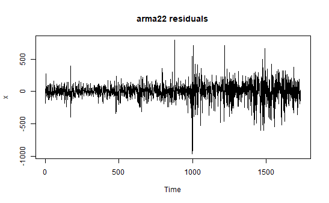

(a) ARIMA(2,0,2)

(b) ARIMA(2,0,0)

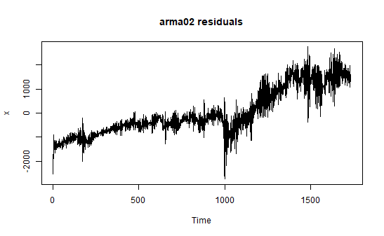

(c) ARIMA(0,0,2)

### **Model Selection**

Compare the performance of different ARMA/ARIMA models using evaluation metrics such as Mean Squared Error (MSE), Root Mean Squared Error (RMSE), and Akaike Information Criterion (AIC). Select the best-performing model based on these metrics. The summary of each model is represented below:

**Summary for ARIMA(2,0,2)**

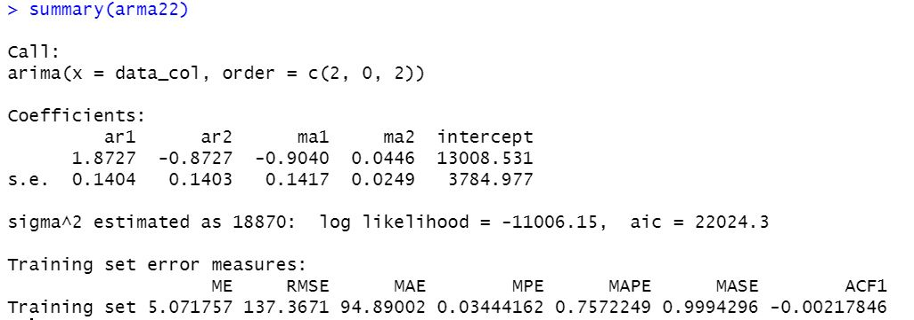

**Summary for ARIMA(2,0,0)**

**Summary for ARIMA(0,0,2)**

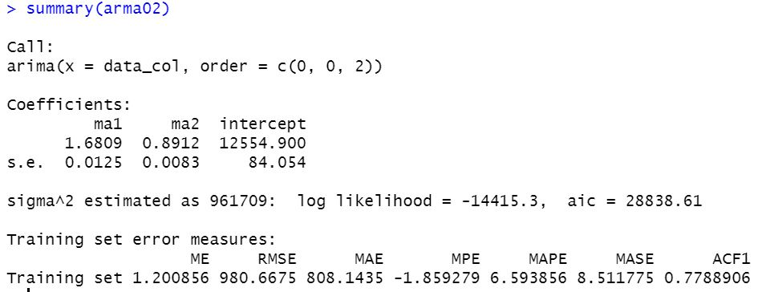

**Interpretations from ARIMA models summary**

When applying the ARIMA (2,0,2) model for time series data, the summary statistics typically include the coefficient values, standard errors, sigma squared, log-likelihood, AIC, and training set error measures.

Interpreting these summary statistics can provide insights into the adequacy of the ARIMA (2,0,2) model for the time series data, as well as the properties of the residuals and the model's goodness of fit.

- The coefficient values represent the autoregressive (AR) and moving average (MA) parameters that govern the behavior of the time series data. These values can be used to interpret the strength and direction of the relationships between past and future values of the time series data.
- The standard errors provide information about the variability of the coefficient estimates. Smaller standard errors indicate greater precision in the estimation of the coefficients.
- The sigma squared value represents the estimate of the variance of the residuals. This value can be used to assess the amount of unexplained variation in the time series data that the ARIMA (2,0,2) model does not account for.
- The log-likelihood value represents the maximum likelihood function value for the estimated model. This value can be used to compare the goodness of fit of different models, with higher values indicating better fits.
- The AIC value measures the relative quality of the model, taking into account the goodness of fit and the complexity of the model. Lower AIC values indicate better models.
- The training set error measures, such as mean absolute error (MAE), root mean squared error (RMSE), and mean absolute percentage error (MAPE), provide information about the accuracy of the model in predicting the time series data. These measures can be used to compare the performance of different models and identify potential improvement areas.

Overall, the summary statistics for the ARIMA (2,0,2) model can be used to assess the adequacy of the model for the time series data, to identify potential areas for improvement, and to compare the performance of different models.

A similar interpretation can easily be made for ARIMA(2,0,0) and ARIMA(0, 0, 2) models

### **ARCH & GARCH Modelling for $y$**

Similar to the ARMA/ARIMA modeling, we have followed the same steps to do the modeling of ARCH/GARCH:

We have used two different variations of the GARCH models:
- GARCH(2,2)
- GARCH(0,2) 

**GARCH(2,2), GARCH(0,2)**

**Plots for residuals**

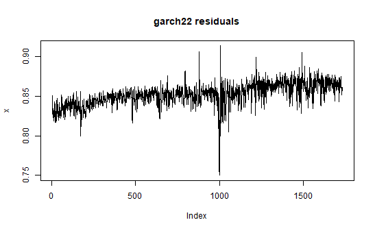

(a) GARCH(2,2)

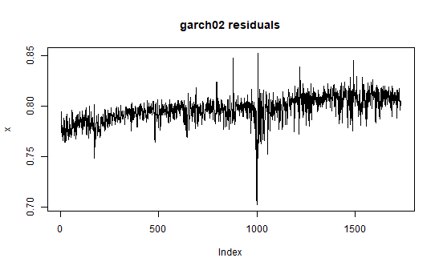

(b) GARCH(0,2)

- **The statistics of residuals are shown in quartile form:** When the statistics of residuals are shown in quartile form, it typically means that the residuals are being summarized using quartiles, which are a type of descriptive statistic that divides the data into four equal parts. Showing the statistics of residuals in quartile form can provide a useful summary of their distribution and can be used to identify potential outliers or skewness in the data.
- **For each of the coefficients, the point estimates are shown:** In time series analysis, point estimates are often used to represent the values of the coefficients of a model. These coefficients represent the effect of various factors on the time series data, such as lagged values or exogenous variables. The point estimates of the coefficients provide valuable information about the relationship between the time series data and the factors that influence it. They can be used to make predictions or to understand the underlying patterns in the data, such as the degree of autocorrelation or seasonality.	
- **Jarque Bera Test for Diagnostic Testing:** The Jarque-Bera test is a statistical test used for diagnostic testing in time series analysis to assess whether the residuals of a model have a normal distribution. The test is based on the skewness and kurtosis of the residuals, which are measures of the shape of the distribution.

  The Jarque-Bera test can be used to assess the adequacy of a model's fit to the data by checking whether the residuals are normally distributed or not. Suppose the p-value of the test is less than a chosen significance level, typically 0.05. In that case, it suggests that the residuals are not normally distributed, and the model may need to be revised or adjusted.

  The Jarque-Bera test is commonly used in time series analysis to ensure that the assumptions of normality are met for the model's residuals, which is important for making accurate forecasts and reliable statistical inferences.

**Summary for GARCH(2,2) & GARCH(0,2)**

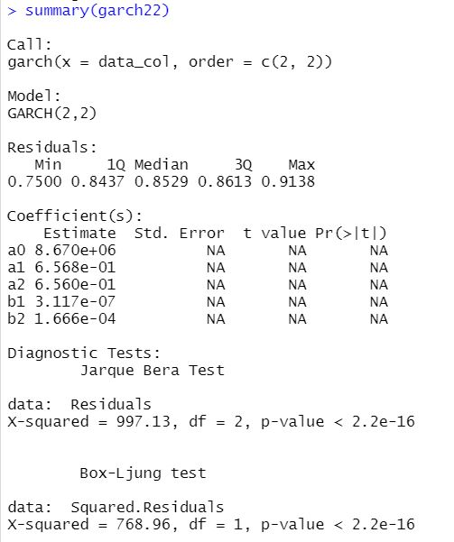

(a) GARCH(2,2)

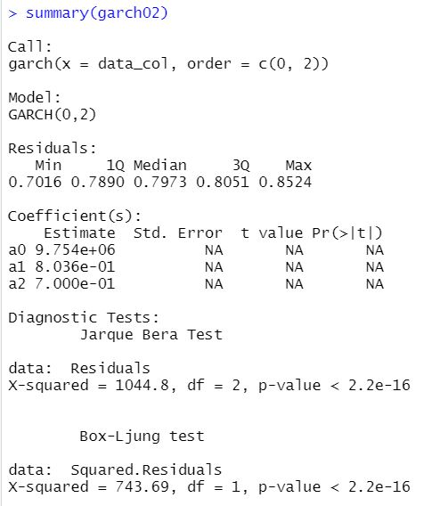

(b) GARCH(0,2)

**Interpretations from GARCH models summary**

When applying the GARCH (2,2) model for time series data, the summary statistics typically include the coefficient values, residual $\chi^{2}$ value, p-value, and degrees of freedom (df) for both the conditional variance equation and the conditional mean equation. In addition, the summary statistics may also include information about the squared residuals, such as their mean, standard deviation, and autocorrelation.

Interpreting these summary statistics can provide insights into the adequacy of the GARCH (2,2) model for the time series data and the properties of the residuals and the conditional variances.

- The coefficient values for the conditional variance equation represent the autoregressive and moving average parameters that govern the volatility of the time series data. These values can be used to interpret the strength and direction of the relationships between past conditional variances and future conditional variances.
- The residual $\chi^{2}$ value represents the sum of the squared standardized residuals, which is used to assess the goodness of fit of the GARCH (2,2) model. A low residual $\chi^{2}$ value suggests that the model fits the data well, while a high value suggests that the model may need to be revised.
- The p-value represents the probability of observing a test statistic as extreme or more extreme than the one observed, assuming the null hypothesis is true. In the GARCH (2,2) modeling context, a low p-value indicates that the coefficient is statistically significant and provides evidence against the null hypothesis of no relationship.
- The degrees of freedom (df) represent the number of observations minus the number of parameters estimated in the model. This value calculates the residual $\chi^{2}$ value and the associated p-value.
- The summary statistics for the squared residuals can be used to assess the distribution and autocorrelation of the squared residuals. Normal distribution and no autocorrelation are desirable properties for the squared residuals in a GARCH (2,2) model, as they suggest that the model is correctly capturing the volatility of the time series data.

A similar interpretation can easily be made for GARCH(0,2) model.

### **Forecasting using ARIMA models**

Use the selected ARMA/ARIMA model to make future forecasts. This can be done using the forecast() function in R or the predict() function in Python. Visualize the forecasted results and interpret the findings.

**Plots for 1000 forecasts using these 3 models**

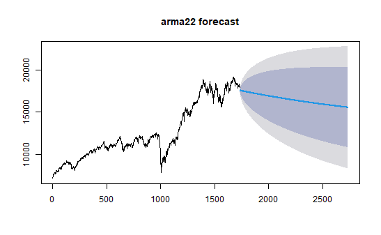

(a) ARIMA(2,0,2)

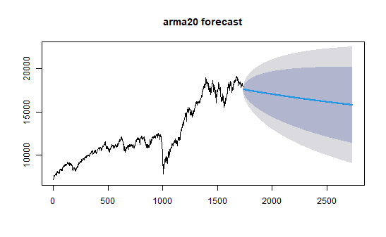

(b) ARIMA(2,0,0)

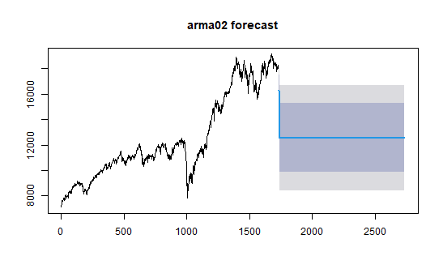

(c) ARIMA(0,0,2)

<!-- ### **Model Evaluation for ARIMA models**

Evaluate the accuracy of the forecasted results using appropriate evaluation metrics such as MSE, RMSE, and MAE (Mean Absolute Error). Compare the forecasted values with the actual values to assess the performance of the ARMA/ARIMA model. -->

